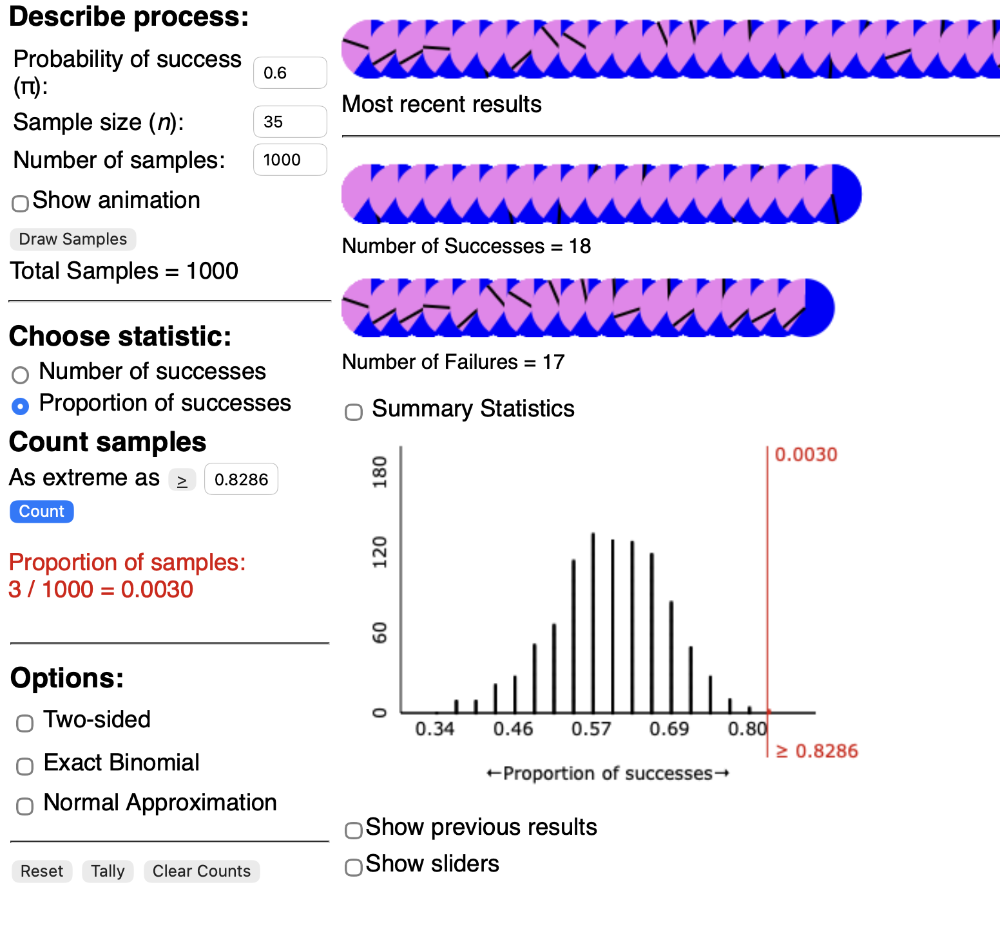

# Problem 1

Are Metacritic reviews of the show expected to be at least 60% favorable or strongly favorable?

# Problem 2

The observational unit is the Metacritic review of one episode.

# Problem 3

Metacritic review; categorical (either favorable or strongly favorable, or other rating)

# Problem 4

Long run proportion of episodes that have a favorable or strongly favorable Metacritic review ($\pi$)

# Problem 5

29/35 = 0.8285714

# Problem 6

> H0: The long run proportion of episodes that have a favorable or strongly favorable Metacritic review is equal to 0.6.

> HA: The long run proportion of episodes that have a favorable or strongly favorable Metacritic review is greater than 0.6.

$$
H_0:\pi=0.6
$$

$$
H_A: \pi\gt0.6
$$

# Problem 7

# Problem 8

Approximately 0.0030 (solutions will vary). This rejects the null hypothesis since p-value < 0.05.

# Problem 9

$Z=\frac{\hat{p}-\pi}{SD}\approx 2.753873$. This is outside the 2's and rejects the null hypothesis.

# Problem 10

Conditions are not met for the theory-based approach since there are not at least 10 successes and 10 failures.

# Problem 11

There is evidence to conclude that the long run proportion of episodes that have a favorable or strongly favorable Metacritic review is greater than 0.6. They can produce the next season!