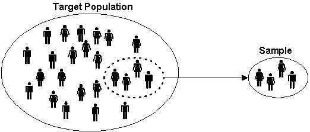
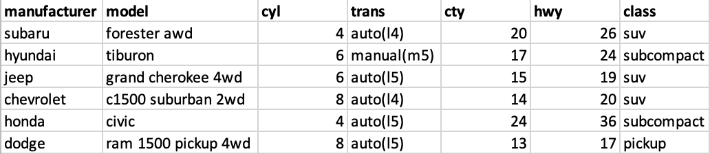
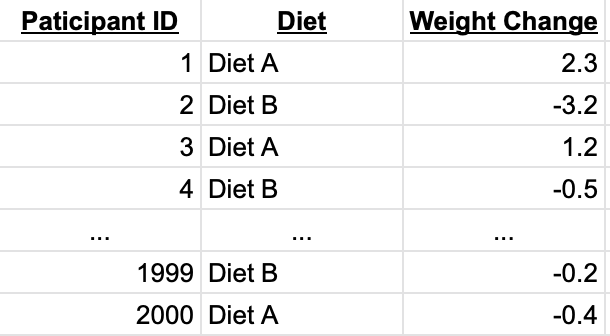
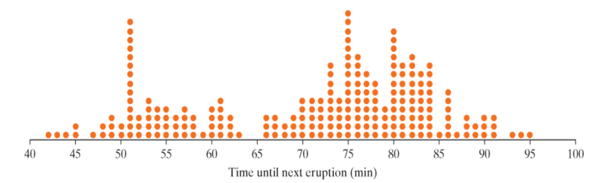
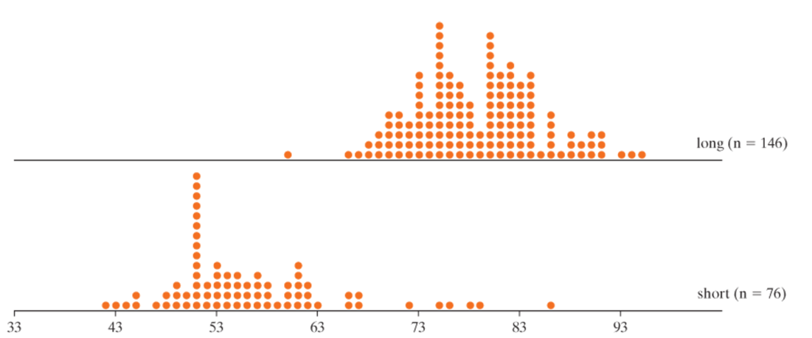

## Statistical Investigation

There are six steps to the statistical investigation process. We will mainly focus on steps 3-5 in our course.

1. Ask a research question
2. Design a study and collect data
3. Explore the data
4. Draw inferences from the data
5. Formulate conclusions
6. Look back and ahead

## Step 1

Ask a research question

- Questions that can be addressed by collecting data

    - Comparing groups
  
    - Does one thing affect something else?
  
    - Assessing opinions

## Step 2

Design a study and collect data

- Selecting people or objects to be studied

- Deciding how to gather relevant data

- Carrying out data collection in a careful, systematic manner

## Step 3

Explore the data

- Looking for patterns related to the research question

- Look for unexpected outcomes that may point to additional questions

- Charts, tables, etc.

## Step 4

Draw inferences from the data

- Determine whether any findings in the data reflect a genuine tendency and estimating the size of that tendency

## Step 5

Formulate conclusions

- Consider the scope of inference from step 4

- Can results be generalized?

- Can a cause-and-effect conclusion be drawn?

## Step 6 

Look back and ahead

- Limitations of the study

- Suggest new studies based on findings

## Terminology

**[Data]{.underline}**: the values measured or categories recorded on individual entities of interest

**[Population]{.underline}**: the complete collection of ALL elements that are of interest for a given problem

**[Sample]{.underline}**: a sub-collection of elements drawn from a population

**[Observation]{.underline}**: the collection of measurements from a particular unit in a sample

**[Observational unit]{.underline}**: the smallest unit to which data is collected

**[Variable]{.underline}**: any measurable characteristic of an observation

## Sample

## Variables

In our course, we will focus on two types of variables: categorical and quantitative.

> [**Categorical**:]{.underline} measurements that are classified into one of a group of categories
> **[Proportion:]{.underline}**

\

> [**Quantitative**:]{.underline} measurements that are recorded on a naturally occurring 

## Example

Suppose a study collected a sample of cars. Are the variables categorical or quantitative?

## Example 1: Weight Loss Study

Suppose that a study wants to compare the weight loss on two diets, Diet A and Diet B, for adults in the United States. The study had 2,000 participants and measured the amount of weight loss on each participant. Identify the following:

Population:

Observational unit:

Sample size:

Variables and their type:

## Example 1 (cont)

A sample of the data is shown below. It may sometimes be important to change the variable type. For example, suppose that you were looking for the proportion of people who showed a decrease in weight. In this case, we would change all negative values to "decrease" and positive values to "increase."

Note: quantitative data can become categorical data, but NOT vice versa.

## Your Turn!

Suppose there are 10 multiple choice questions, which all questions have three options: A, B, and C. You are interested in the proportion of times that A is the correct answer.

> Observational unit- 
> 
> Variable of interest- 
> 
> Categorical or quantitative- 

If the correct answer was placed completely at random, what would be a typical proportion of times that A is the correct answer? 

## Helper or Hinderer

Check out the following study: <https://www.youtube.com/watch?v=HBW5vdhr_PA>

- A study investigated whether infants take into account an individual's actions toward others in evaluating that individual as appealing or aversive (perhaps laying the foundation for social interaction)

- 16 infants (10-months old) were shown a "climber" character that could not make it up a hill in two tries

- Two scenarios were provided:

  - The climber received help from another character ("helper")

  - The climber was pushed back down by another character ("hinderer")

- The infant was then presented with the helper and hinderer and was asked to pick one to play with

---

**Step 1: Ask a Research Question**

- Are infants able to notice and react to helpful or hindering behavior observed in others?

- In general, what do the researchers wish to know or investigate

**Step 2: Design a Study and Collect Data**

- Recruit families with 10-month-old infants

- Ask them to have their baby watch the short puppet shows.

- After the show, see which toy the baby would like to play with.

- Repeat for each of the participating babies.

---

**Step 3: Explore the Data**

- Visually: Bar graph, pie charts, box plots, histograms

- Numerically:

  - Picked the helper toy: 14

  - Picked the hinderer toy: 2

  - Proportion who picked the helper = $\frac{14}{16}$ = 0.875

    - i.e. 87.5% of babies picked the helper toy.

**Step 4: Draw Inferences Beyond the Data**

- Whether 14/16 was large enough to indicate that the helping seen had a genuine effect on which toy was chosen

- Need to decide if the babies are picking the toy randomly, or if the puppet shows really have an effect of which toy the kids choose.

- If the kids were really picking the toy at random, how often would they pick the helper?

  - Is 14 out of 16 much different than that?

---

**Step 5: Formulate Conclusions**

- The babies do in fact have a preference for the helper toy when compared to the hinderer

- Scope of inference: Can we say this is true for all babies in the world? In the United States? Another group?

**Step 6: Look Back and Ahead**

- Limitations?

- Potential improvements?

- Future directions?

---

**Do 10-Month-Old Infants Show a Preference for the Helper Toy Over the Hinderer Toy?**

- Why was it important for the researchers to balance out the color, shape, and order of the toys across the study?

  - Control for the babies preference for color, shape, or toy.

- Identify the following in the context of this example:

  - Variable of interest:

  - Data type:

  - Population of interest:

  - Sample:

---

How many infants do you expect to choose the helper toy?

  - Recall: Total of 16 babies

  - Expect

Suppose that 10 out of 16 infants choose the helper toy (62.5%). Since this value is higher than 50%, a researcher argues that these data show that the majority of all 10- month-old infants would choose the helper toy.

  - What is wrong with their reasoning?

  - 10 is not that much higher than 8 (62.5% is close to 50%)

---

Researchers found that 14 out of 16 infants chose the helper over the hinderer

- Is this odd? Do we have evidence to show that a majority of babies will prefer the helping toy?

  - 14 out of 16 is quite a bit but there are issues with the study design and sampling technique

## Distributions

Distributions are the pattern (or behavior) or outcomes for variables. When looking at distributions, there are a few important things to take note of.

- [Shape:]{.underline} symmetric, mound-shaped, skewed?
- [Center:]{.underline} where does the center of the pattern appear?
- [Variability:]{.underline} how spread out is the distribution?
    - [Standard deviation:]{.underline} the "average" spread of all data points away from the mean
- [Unusual data:]{.underline} Outliers?

## Shape

Skew Left
\
\
\
Symmetric
\
\
\
Skew Right
\
\
\
If a distribution has two or more mound/peaks, comment on these rather than the skewness.

## Example 2: Old Faithful

Millions of people from around the world flock to Yellowstone Park to watch eruptions of Old Faithful Geyser. Suppose the park ranger gives you a prediction for the next eruption time, and then that eruption occurs five minutes after that predicted time. Would you conclude that predictions by the Park Service are accurate or not very accurate?

In order to better predict the times until the next eruption of Old Faithful, researchers collected times until the next eruption on 222 eruptions of Old Faithful taken over a number of days in August 1978 and August 1979.

- Observational unit:

- Sample:

- Population:

- Variable of interest:

- Categorical or quantitative:

---

The data is graphed below.

- What does each dot on the graph represent?

- How would you describe the shape of the dot-plot above?

- What are some possible explanations for the variability in times?

---

The following dot-pots show the times between eruptions of Old Faithful geyser separated by duration of previous eruption.

Describe the following for the separate dot-plots. How do they compare to each other? To the overall dot-plot?

- Shape:

- Center:

- Variability:

## Gathering Evidence

**[Random Process:]{.underline}** A random process is a process that can be repeated a very large number of times (theoretically infinitely many times) under identical conditions where outcomes cannot be known in advance.

**[Probability:]{.underline}** The probability of an outcome is the long run proportion of times that outcome would occur if a random process were repeated a very large number of times under identical conditions.

**[Simulation:]{.underline}** Artificially re-creating a random process.

- Can be done using computer, dice, cards, coins, etc...
