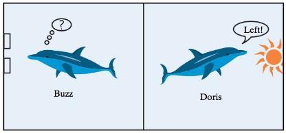
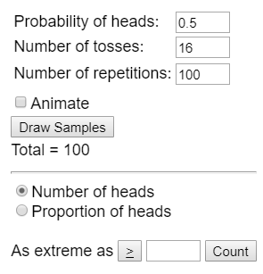
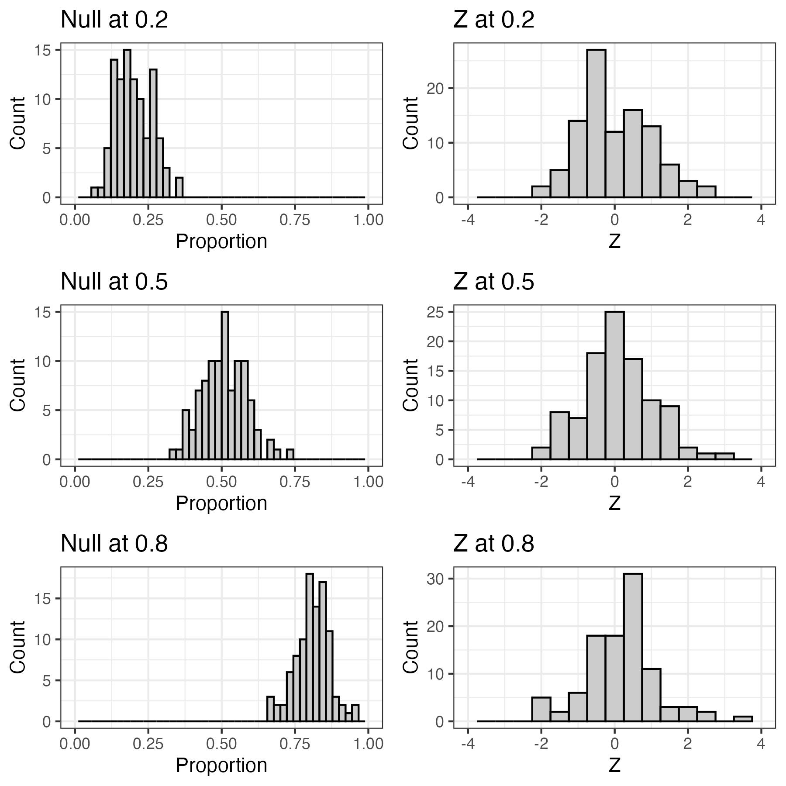
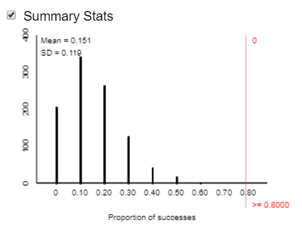
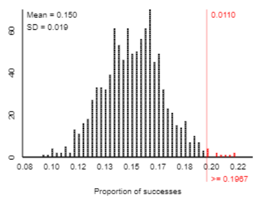
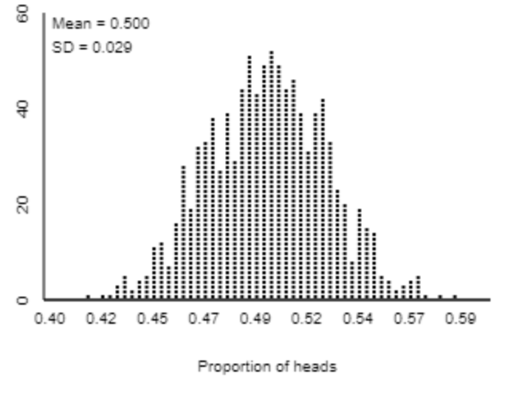

<!---
  revealjs:
    smaller: true
    fig-align: center
    chalkboard:
      theme: whiteboard
      boardfmarker-width: 2
--->

## Terminology

**Sample:** the set of observational units on which we collect data

**Sample size:** the number of observational units in the sample

**Statistic:** the number summarizing the result of the \_\_\_\_\_\_\_\_\_\_\_\_\_

**Population:** the collection of ALL elements that are of interest for a given problem

**Parameter:** the long-run numerical property of the \_\_\_\_\_\_\_\_\_\_\_\_\_\_\_\_

- "The long run 'statistic' ... context."

**Probability:** long-run \_\_\_\_\_\_\_\_\_\_\_\_\_\_ of times an outcome from a random process occurs

## Parameters vs. Statistics

Parameters are the values belonging to the population of interest. In most cases, this will be an \_\_\_\_\_\_\_\_\_\_\_\_\_ value.

Statistics are observed values from a sample. These are always \_\_\_\_\_\_\_\_\_\_\_ and are used to estimate the parameter.

## Chance Models

**Chance models:** A real or computerized process to generate data according to a well-understood set of conditions

Consider the Helper / Hinderer experiment

- (Observed) Statistic: 14 out of 16 infants chose the helper

- Had the infants been randomly selecting between the two options, how many infants would we expect to select the helper by chance? 8/16

**Statistical significance:** is 14/16 likely to happen by chance? Would 10/16 be likely by chance?

## Example: Doris and Buzz {.scrollable}

In 1964, two dolphins (Buzz and Doris) were trained to push one of two buttons in a pool in reaction to a light. If the light flashed, the dolphins pushed the button on the left to get a fish. If the light was constant, the dolphins needed to push the button on the right. Once they learned this behavior, the dolphins were separated by a wall (only Doris could see the light; only Buzz could push the buttons). To get a fish, Doris would need to communicate with Buzz. The researcher, randomly deciding to make the light shine constant or flash, tested the dolphins' ability to communicate.

- Out of 16 attempts, the dolphins pushed the correct button 15 times.

1.  **Ask a Research Question**

    - Can dolphins communicate in an abstract manner?

2.  **Design a Study and Collect Data**

    - Observational Unit?

    - Variable of Interest?

    - Categorical or Quantitative?

3.  **Explore the Data**

    - Sample?

    - Observed Statistic?

4.  **Draw Inferences Beyond the Data**

    - Parameter- the long-run proportion of times Buzz pushes the correct button

      - Unknown because we cannot observe every selection Buzz ever makes

      - Use our sample to make general conclusions about the parameter

5.  **Formulate Conclusions**

    - Two Possibilities

      - Buzz is just guessing

      - Something else is going on (i.e. the dolphins are actually communicating)

    - Conclusions for the above two possibilities based on our sample data

    - To find evidence in support of either conclusion**,** must generate data to simulate what would happen if guessing

## 3S Strategy

We will focus on using the 3S strategy to determine if outcomes are likely due to chance.

1.  **Statistic**: from the observed sample data

2.  **Simulate**: Identify a "by chance alone\" model (**chance model**) for scenario, and repeatedly simulate values for the statistic under that model.

3.  **Strength of Evidence**: Unusual statistic? Does it fit into the pattern of the probability distribution?

    - Unlikely --  Not by chance, more than guessing

    - Likely -- Chance model is plausible

## Simulating a Null Distribution

A null distribution is the behavior that we would expect to occur under \_\_\_\_\_\_\_\_\_\_\_.

- What are the two possible outcomes for each trial? Are these equally weighted?

- What is the probability that each outcome occurs under the assumption that Buzz and Doris are actually not communicating?

  - i.e. How could we simulate Buzz guessing?

- How many trials did we have in this study?

  - i.e. Sample size?

In the case of Buzz and Doris, we can flip a coin to simulate the process of Buzz randomly guessing.

## Simulation

  --------------------------------------------------------------------------------------------------------
  Simulation                          Real Study
  ----------------------------------- --------------------------------------------------------------------
  Coin Flip                           Guess by Buzz

  Heads                               Correct Guess

  Tails                               Incorrect Guess

  Chance Model                        0.5 probability of picking correct button if Buzz is just guessing

  One repetition                      One set of 16 simulated attempts by Buzz
  --------------------------------------------------------------------------------------------------------

- Grab a coin and flip it 16 times (or go to <https://www.random.org/coins/>)

- Keep track of how many times the coin landed heads up.
- Record your value on the whiteboard
- What does each "dot" on the plot represent?

## More simulations

Say that we would want 100 repetitions of this process. Flipping a coin would be tedious to do. To alleviate this issue, we can use the "One Proportion" applet (<<http://www.isi-stats.com/isi2nd/applets2021.html>). 

## Simulation Results

Based on the dot-plot, would you be convinced of the research question if the study showed...

- 15 out of 16 trials Buzz chose the correct button?

- 10 out of 16?

- 13 out of 16?

- 12 out of 16?

- When do you become convinced?

# Measuring Strength of Evidence

## Symbols

$\pi$ (pi) is the \_\_\_\_\_\_\_\_\_\_\_\_\_\_ symbol for [proportions]{.underline}

- "Long run proportion"

- Since it is for a population, we typically do not know this value

$\widehat{p}$ (p-hat) is the \_\_\_\_\_\_\_\_\_\_\_\_\_\_\_\_\_\_\_\_\_\_\_ for [proportions]{.underline}

- This is the value that comes from our sample

n is the sample size

Example: Helper-Hinderer

- Parameter ($\pi$) -- The long run proportion of times a baby choses the helper toy.

- Observed Statistic: $\widehat{p} = \frac{14}{16} = 0.875$

- Sample Size: $n = 16$

## Hypothesis

When establishing a hypothesis, we need two components: a null and alternative hypothesis.

$H_{o} \rightarrow$ Null: "random chance alone"

  - Chance model
  
  - Equal to (=)

$H_{A} \rightarrow$ Alternative: "there is an effect"

  - What researchers hope to support

  - Pick \<, \>, or $\neq$ based on what the researchers would like to show

## Hypothesis -- One Proportion

Null hypothesis (for proportions):

- $\pi$ = "expected parameter value"

Alternative hypothesis (for proportions):

- $\pi$ (\<, \>, $\neq$) "expected parameter value"

- Choose (\<, \>, $\neq$) from the research question

## Example: Buzz and Doris

In Words:

- Null: The long run proportion of times Buzz guesses correctly is equal to 0.5.

- Alternative: The long run proportion of times Buzz guesses correctly is greater than 0.5.

In Symbols:

- $H_{o}:$
\
\
\
- $H_{A}:$

## What Parameter Value to Test?

For proportions, our null hypothesis will not always be equal to 0.5. Consider the context of the following research questions.

  -------------------------------------------------------------------------------------------------------------------
  **Research question**                                            **Null hypothesis**   **Alternative Hypothesis**
  ---------------------------------------------------------------- --------------------- ----------------------------
  Do even numbers appear less often than odd numbers on a die?                           

  Does a card dealer have an ace show up more often?                                     

  Are there more traffic accidents in winter than other seasons?                         
  -------------------------------------------------------------------------------------------------------------------

## Example: Rock Paper Scissors

**Research question:** do you throw scissors less than paper and rock?

Suppose you played a friend 12 times and you chose scissors 3 times. Identify the following.

- **Observational unit:**

- **Sample size:**

- **Variable of interest:**

- **Parameter ($\pi$):**

- **Observed statistic (**$\widehat{\mathbf{p}}$**):**

## Example: Rock Paper Scissors Hypothesis

Set up the null and alternative hypothesis in both words and symbols.

In words:

- Null: The long run proportion of times you chose scissors is equal to 0.33

- Alternative: The long run proportion of times you chose scissors is less than to 0.33

In symbols:

- $H_{0}:$
\
\
\
- $H_{A}:$

## Example: Rock Paper Scissors Simulation

Using the 3S Strategy, we can gather strength of evidence for our research question.

- Statistic: How many times did you throw scissors?

- Simulate with the applet

  - Compare your statistic to simulation

  - Did you randomly throw scissors?

  - Throwing scissors more or less often?

## P-Value

**p-value:** the \_\_\_\_\_\_\_\_\_\_\_\_\_\_ of obtaining a simulated value that is \_\_\_\_\_\_\_\_\_\_\_\_\_\_\_\_\_\_\_ than the observed statistic when the null hypothesis is \_\_\_\_\_\_\_\_.

- This value will always be between \_\_\_ and \_\_\_

- Finding statistics in the direction of the \_\_\_\_\_\_\_\_\_\_\_\_\_ hypothesis

- The \_\_\_\_\_\_\_\_ the p-value, the \_\_\_\_\_\_\_\_\_ the evidence AGAINST the \_\_\_\_\_\_ hypothesis

## P-value table

In this course, we will mainly focus on the cutoff value for p-values \< 0.05. This means that statistics with a p-value of 0.05 or less are considered statistically significant. That is, the statistic has a 1 in 20 chance (or less) to have occurred by chance.

  --------------------------------------------------------------------------------------
              **p-value**                           **Amount of evidence**
  ----------------------------------- --------------------------------------------------
            0.10 \< p-value               Not much evidence against null hypothesis

        0.05 \< p-value \< 0.10         Moderate evidence against the null hypothesis

        0.01 \< p-value \< 0.05          Strong evidence against the null hypothesis

            p-value \< 0.01            Very strong evidence against the null hypothesis
  --------------------------------------------------------------------------------------

## P-value example

Consider the Rock Paper Scissors example. When we simulate the 12 matches 100 times, we get the following null distribution.

\
\
\
\
\

p-value: probability of obtaining a simulated value as or more extreme than the observed statistic when the null hypothesis is true

- Observed statistic (3)

Counting in the direction of the alternative hypothesis ($\pi$ \< 0.33)

- 0 scissors: 0 times

- 1 scissors: 4 times

- 2 scissors: 16 times

- 3 scissors: 18 times

38 simulations had as or more extreme values than our observed statistic. With the 100 simulations, our p-value is \_\_\_\_\_\_\_\_

## Conclusions

p-value \< 0.05

- Reject the null hypothesis (R)
- "We have evidence to conclude the alternative hypothesis (in context)"

p-value \> 0.05

- Fail to reject the null hypothesis (FTR)
- "We do not have evidence to conclude the alternative hypothesis (in context)"

Remember, we do not know what the parameter is, only that the observed statistic either rejects or fails to reject the null hypothesis

- NEVER say "we conclude the null hypothesis is true"

## Conclusions -- Rock-Paper-Scissors

From the Rock-Paper-Scissors example, we observed a p-value of 0.38, which is greater than 0.05. This means that we fail to reject the null hypothesis.

- Conclusion: We do not have evidence to conclude the long-run proportion of scissors thrown is less than 1/3.

- What if our p-value was 0.003?

  - Conclusion: We have evidence to conclude the long-run proportion of scissors thrown is less than 1/3.

## Your Turn!

You suspect that your friend has a weighted 6-sided die that they use on game night. When they go use the bathroom, you secretly roll their die a total of 15 times and observe that a 6 (the best number to roll in the game) was rolled 5 times. After heading home, you conduct a simulation 100 times, which gives a p-value of 0.07.

Answer the following questions:

- What is the observational unit?

- What is the sample size?

- How would you set up the hypothesis (in words and symbols)?

> $H_{0}:$
\
\
\
> $H_{A}:$

- What conclusion can you say about your friend's die?

# Alternate Measures of Strength of Evidence

## Definitions

**[Standard Deviation:]{.underline}** Measure of how spread-out data points are away from the center

- Larger standard deviation means \_\_\_\_\_ variability

- Smaller standard deviation means \_\_\_\_\_ variability

**[Standardized Statistic:]{.underline}** How far an observed statistic is from the mean of the null distribution (hypothesized value)

$$z = \frac{Observed\ Statistic - Hypothesized\ Value}{Standard\ Deviation\ under\ the\ null}$$

## Standardized Statistic

Use the applet to simulate a null distribution

Get the standard deviation from applet

$$z = \frac{Observed\ Statistic - Hypothesized\ mean}{\ SD}$$

How to interpret the Z statistic

- When we standardize a statistic, we are essentially placing that statistic in the null distribution

- The observed statistic is "Z" standard deviations above (+) or below (-) the mean of the Null distribution.

- Normally use +/- 2 as a single cut-off ("Is it outside the 2's?")

- The farther the standardized statistic is away from zero, the stronger the evidence against the null

## How Does the Standardized Statistic Work?

Consider the simulation studies

:::{.columns}
:::{.column}

- Sample size: 45

- Replications: 100

- Nulls at 0.2, 0.5, and 0.8
:::

:::{.column}

:::
:::

## Example: Heart Transplant Operations {.scrollable}

In an article published in the British Medical Journal (2004), researchers Poloniecki, Sismanidis, Bland, and Jones reported that heart transplantations at St. George\'s Hospital in London had been suspended in September 2000 after a sudden spike in mortality rate. Of the last 10 heart transplants, 80% had resulted in deaths within 30 days of the transplant. Newspapers reported that this mortality rate was over five times the national average. Based on historical national data, the researchers used 15% as a reasonable value for comparison. We would like to know whether the current underlying heart transplantation mortality rate at St. George\'s Hospital exceeds the national rate.

- **Research question:** Is the proportion of patients who die within 30 days of a heart transplant at St. George's greater than that of the national average?

- **Observational Units:** one heart transplant

- **Variable of Interest:** mortality (died or not)

- **Parameter:** The long run proportion of patients who die within 30 days of a heart transplant at St. George.

- **Statistic:** 80%

- **Hypothesis**

  - Words:

    - [Null:]{.underline} The long-run proportion of patients who die within 30 days of a heart transplant at St. George's is equal to 0.15.

    - [Alternative:]{.underline} The long-run proportion of patients who die within 30 days of a heart transplant at St. George's is greater than 0.15.

  - Symbols:

    - $H_{o}:\ \pi=0.15$

    - $H_{A}:\ \pi>0.15$

Run 1000 simulations of sample size 10 using the one proportion applet.

- What is your p-value? \<0.001

  - Note: we never say we have a p-value = 0 since nothing is technically "impossible"

- Click "Summary" Statistics. What is your standard deviation?

- Calculate the standardized statistic.

  - Observed Statistic = **0.8**

  - Null value (hypothesized value) = **0.15**

  - Standard deviation = **0.119**

  - Standardized Statistic = $\frac{\mathbf{0.8 - .15}}{\mathbf{0.119}}\mathbf{=}\mathbf{5}\mathbf{.}\mathbf{47}$

## Example: Heart Transplant Operations (cont.)

Now assume we collected a larger sample and found that 71 out of 361 patients whom received a heart transplant at St. George hospital died.

- What is your new observed statistic? 

- Run 1000 simulations of sample size 361.

  - What is your p-value? 

- Calculate the standardized statistic.

  - Observed Statistic = 

  - Null value (hypothesized value) = 

  - Standard deviation = 

  - Standardized Statistic =
  
---

  
## Example: Heart Transplant Operations (cont.)

  -------------------------------------------------------------------------------------------------------------------------------
                            **n = 10**                                                     **n = 361**
  -------------------------------------------------------------- ----------------------------------------------------------------
                      Statistic = 8/10 =0.8                                          Statistic = 71/361=.197

                         Null value= 0.15                                                Null value= 0.15

                Standard deviation of null = 0.119                              Standard deviation of null = 0.019

   Standardized Statistic: $z = \frac{0.8 - .15}{0.119} = 5.47$   Standardized Statistic: $z = \frac{0.197 - .15}{0.019} = 2.47$
  -------------------------------------------------------------------------------------------------------------------------------

The observed statistic falls 'Z' standard deviations above the mean of the null distribution

## Comparing P-Values vs Standardized Statistics

Large standardized statistic -- Small p-value -- Reject Null -- Evidence to conclude *alternative*

Smaller standardized statistic -- Large p-value -- Fail to Reject Null -- No Evidence to conclude *alternative*

  --------------------------------------------------------------------------------------------
  **Strength of evidence**           **P-value**                  **Standardized statistic**
  ---------------------------------- ---------------------------- ----------------------------
  **Strong Evidence against Null**   Less than or equal to 0.05   Below -2 or Above 2

  --------------------------------------------------------------------------------------------

# What Impacts Strength of Evidence?

There are three components that can influence the strength of evidence.

1.  Distance between observed statistic and null value

2.  Sample size

3.  One-sided vs Two-sided alternative hypothesis

## Distance Between Observed Statistic and Null Value

Null value -- What would we expect to see based on random chance?

- Where is the null distribution \_\_\_\_\_\_\_\_\_\_?

- Farther apart -- Random chance/null less plausible

- P-value gets \_\_\_\_\_\_\_\_\_\_\_

- Standardized statistic \_\_\_\_\_\_\_\_\_\_

Closer together -- Random chance becoming more plausible

- P-value gets \_\_\_\_\_\_\_\_\_\_

- Standardized statistic \_\_\_\_\_\_\_\_\_\_\_\_\_

## Sample Size

As sample size increases, variability of the null distribution \_\_\_\_\_\_\_\_\_ and strength of evidence increases

As the sample size **increases** (and the value of the observed sample statistic stays the same) the strength of evidence **increases.** (i.e. reject the null more).

As the sample size **decreases** (and the value of the observed sample statistic stays the same) the strength of evidence **decreases.** (i.e. reject the null less).

## One-Sided vs. Two-Sided Alternative Hypothesis

**One-sided alternative**

- Researchers indicate whether they think they will observe data greater than or less than the chance model (exclusively in one direction)

**Two-sided alternative**

- Don't have idea/interest in which way statistic is going to fall

- Only care if there is a **difference** (e.g., $\pi \neq 0.5$)

- Causes p-values to approximately \_\_\_\_\_\_\_\_\_\_\_ (because we also look as or more extreme in the other direction too)

## Example: One-Sided vs. Two-Sided Tests

Rock/Paper/Scissors

  - Do we really think people throw scissors **less** often? (***One-sided-test)***

  - Do we throw scissors **differently** than rock and paper? (***Two-sided-test)***

# Theory Based Approach

It is not always necessary to use a simulation to gather our strength of evidence. In fact, we can use mathematical theory to predict the pattern of the null distribution. From the theoretical distribution, we are able to find p-values and standardized statistics.

**Null Distribution Commonalities**

- Sample size (helps to determine variability)

- Symmetric 'bell' shaped distribution

- Centered at null hypothesis value

**Can predict things about null...**

- Where it will be centered

- If its bell shaped (normally distributed)

- Standard deviation of the null distribution (also called the \_\_\_\_\_\_\_\_\_\_\_\_\_\_\_\_\_\_\_\_\_\_)

## Central Limit Theorem

If the sample size (n) is large enough, the distribution of the sample proportions will be bell-shaped (or approximately normal), centered at the long run probability ($\pi_{o}$), with a standard deviation of

$$Standard\ deviation\ of\ the\ null = \sqrt{\frac{\pi_{o}(1 - \pi_{o})}{n}}$$

Going to be used as the *standard deviation of the null* in the denominator of the standardized statistic

$$z = \ \frac{statistic - hypothesized\ value}{standard\ deviation\ of\ the\ null} = \frac{\widehat{p} - \pi_{0}}{\sqrt{\frac{\pi_{o}(1 - \pi_{o})}{n}}}$$

## Validity Conditions

For the theory approach to work, we need the data to satisfy certain conditions. For single proportions, there needs to be at least 10 success and 10 failures in the sample.

Consider the St. George example.

- 10 heart transplants

- \# of successes? (i.e. patient died)

- \# of failures? (i.e. patient lived)

- Are the validity conditions met?

## Review of Theory Approach

If you want to use Theory Based approach

- Need a sample size large enough, to say the null will follow the Normal Distribution

- Applet -- Normal approximation button

  - Will calculate the p-value for us

- Can calculate Standardized statistic by hand

This does not always work.

- If the sample size is small ...

  - null distribution will not be approximately bell-shaped and the resulting normal approximation p-value and standardized statistics are not accurate

- Simulation ALWAYS works

## Husker Example {.scrollable}

**Research Question:** Do husker fans show a preference for football over volleyball?

Researchers took a sample of 283 husker fans and found that 148 preferred to go to a football game over a volleyball game.

**Hypotheses**

> $$H_{o}:\pi = 0.5$$
>
> $$H_{A}:\pi > 0.5$$

**Variable of Interest:** Football or Volleyball (Categorical)

**Parameter & Symbol:** The long run proportion of husker fans who prefer football. ($\pi$)

**Statistic & Symbol:** $\widehat{p}=148/283 = 0.523$

**Can theory-based method be used?** (i.e., validity conditions met?)

- Yes, because "successes" (selecting football) $148 > 10$ and "failures" (selecting volleyball) $135 > 10$.

**Theory Approach**

Standard Deviation of the Null =$\sqrt{\frac{\pi_{o}(1 - \pi_{o})}{n}} = \sqrt{\frac{0.5(1 - 0.5)}{283}}$ = 0.0297

Standardized Statistic = $\frac{0.523\  - 0.5}{0.0297} = 0.774 \rightarrow FTR$

**Simulation Approach**

Standardized Statistic = $\frac{0.523\  - 0.5}{0.029} = 0.793 \rightarrow FTR$

**Conclusion**

No, we do not have evidence to conclude that the long-run proportion of husker fans who prefer football is greater than 0.5.
