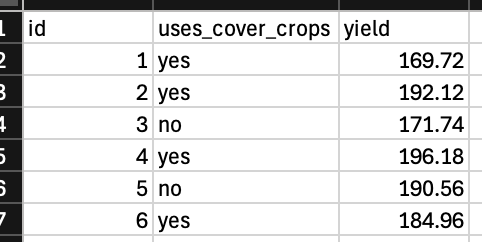
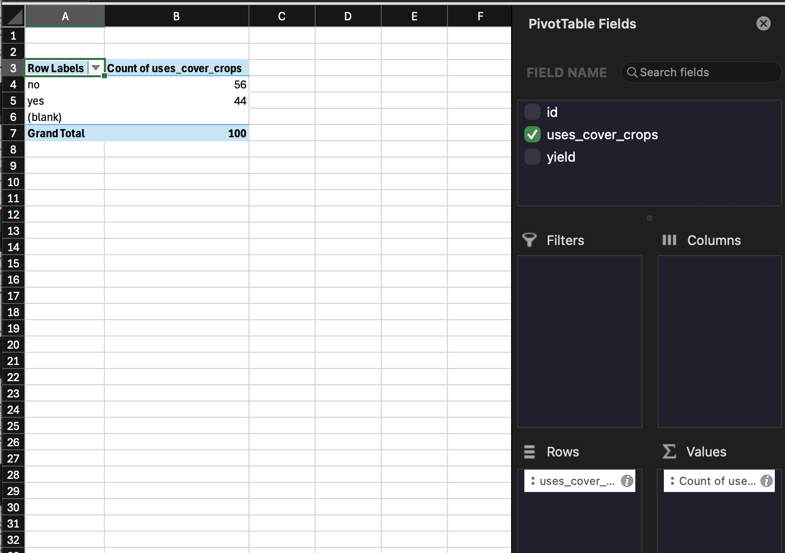
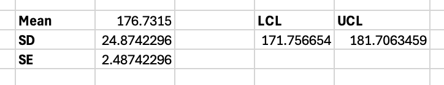

Microsoft Excel is a widely used spreadsheet program for storing and using data. Here, we will look at how to use Excel for helping us with our calculations.

The data below is available on the course webpage as Corn yield: computations using Excel. 

Three variables are present.

- id: the identifier for the observational unit
- uses_cover_crops: identifies whether cover crops were used or not
- yield: the yield of corn.

Suppose that farmers want to know if the long-run proportion of crops from their population that use cover crops is greater than 50%. We would establish this test as follows:

$$
H_0: \pi=0.5
$$

$$
H_A:\pi>0.5
$$

We first need to calculate the proportion of crops that are "yes" and the total number of crops. The easiest way to do this in Excel is to use PivotTables. This can be accomplished by selecting the columns of our data and selecting Insert -> PivotTable. Counts for each category of uses_cover_crops can be computed by dragging uses_cover_crops to the Rows and Values sections of the PivotTable Fields. 

From here, we can now compute our statistic, $\hat{p}$, and our standardized statistic / confidence intervals. To have Excel do these computations for use, in an empty cell, use "=44/100" to get our sample proportion. Then, enter the following into another empty cell: "=(Cell of sample proportion-0.5)/SQRT((0.5*(1-0.5))/100)". For confidence intervals, we use our formula across two cells to get the lower and upper limits. 

- Lower Confidence Limit: =p_hat cell-2\*SQRT((p_hat cell\*(1-p_hat cell))/100)
- Upper Confidence Limit: =p_hat cell+2\*SQRT((p_hat cell\*(1-p_hat cell))/100)

It may also be helpful to precalculate the standard error before doing these calculations.

For quantitative data, like yield, you can use PivotTables to calculate the mean and standard deviation. However, we can also use formulas for this calculation. Using "=AVERAGE(Column)" and "=STDEV(Column)", we can get these values and compute our standardized statistics and confidence intervals in a similar fashion. For example, in an empty cell, we can compute the standard error as "=STDEV(Column)/SQRT(100)" and get the confidence intervals by computing $\bar{x}\pm2\times SE$. 

